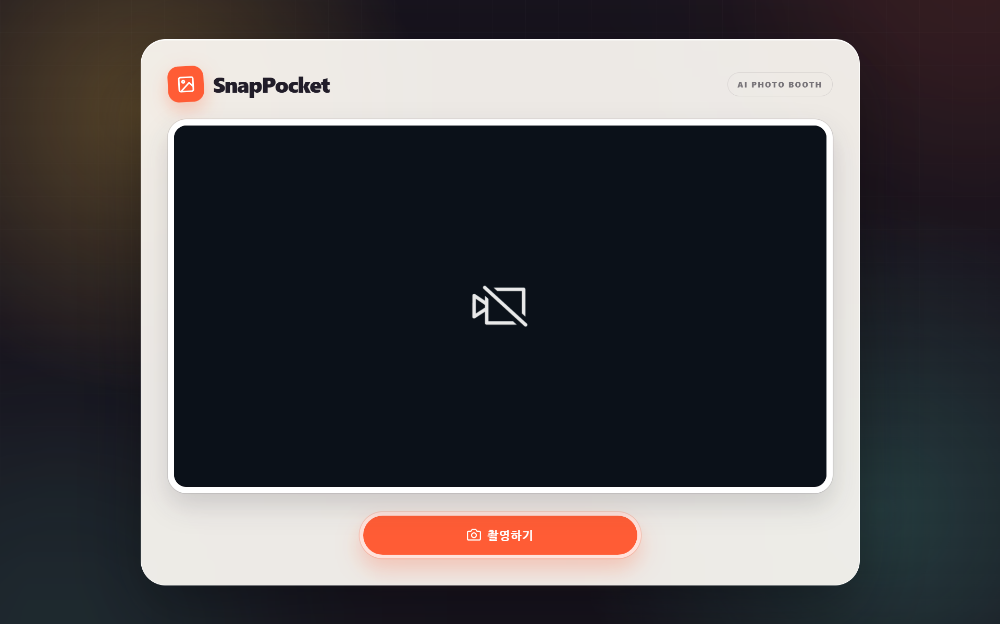
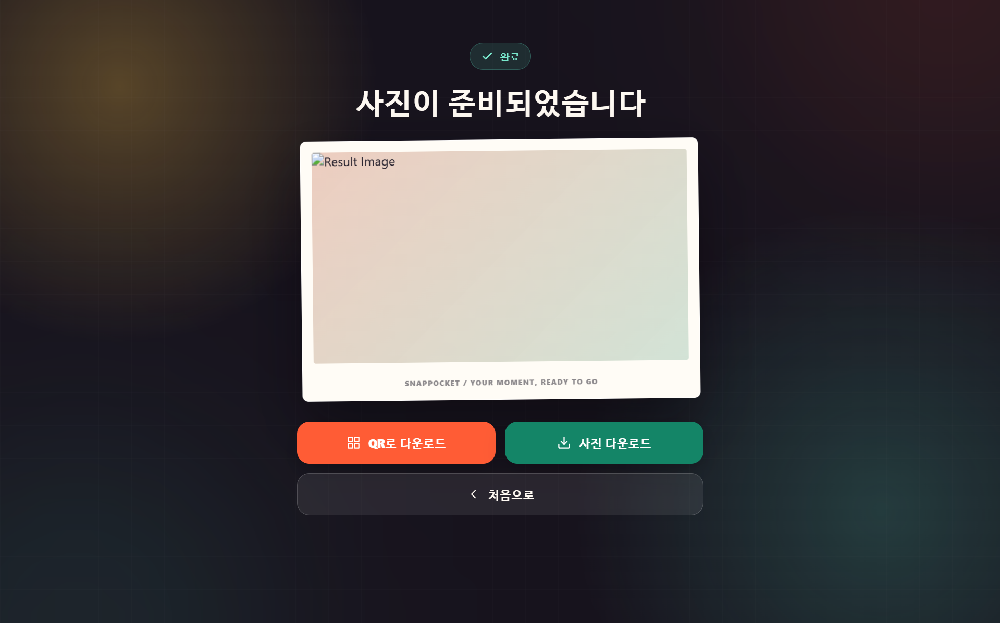
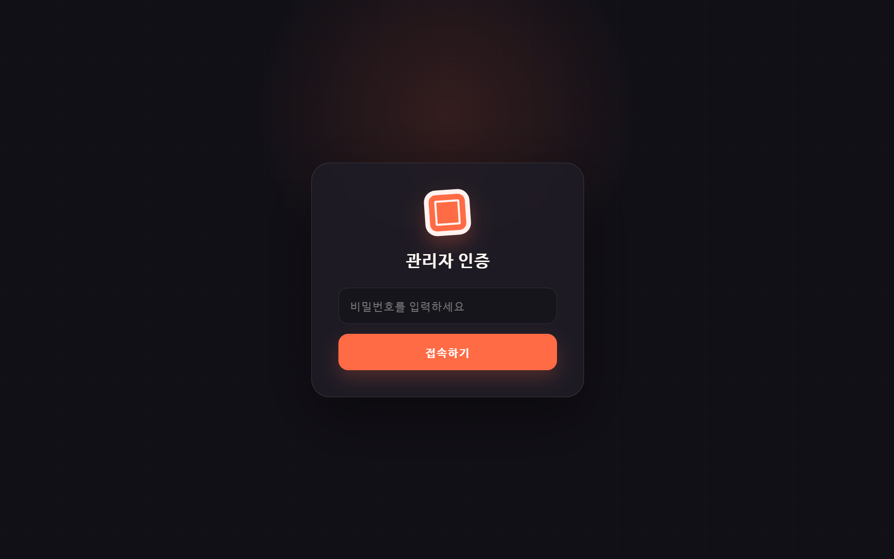
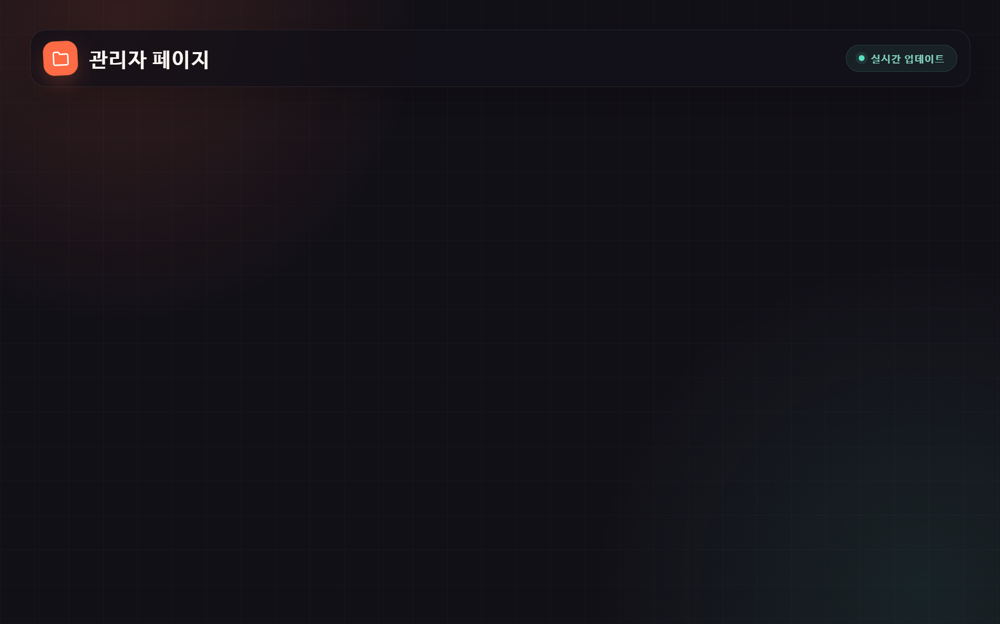

> **[IMPORTANT]**
> Before running this repository, update `checkpoints.json` and `templates/index.html` to match the Stable Diffusion models installed on your system. Model names, paths, and style settings must agree with your local WebUI configuration.

---

# SnapPocket — AI Photobooth System

> 스냅 한 장, 포켓 속으로.
>
> SnapPocket — Capture. Transform. Save.

**Portable Version is available at [movenb3at/snap-pocket-portable](https://github.com/movenb3at/snap-pocket-portable).**


SnapPocket is a web-based AI photobooth system that automates the entire experience—from camera capture and AI style transformation to QR-based photo delivery.

- AI style transformation powered by Stable Diffusion and `img2img`
- Optional branded photo frames with live color previews and ten presets
- Instant attachment downloads through QR codes
- Password-protected monitoring of captured and generated images from the admin page
- Local-network operation with automated HTTPS access through a Cloudflare Quick Tunnel
- Designed for festivals, weddings, brand activations, arcades, and other events

---

## Features

| Feature | Description |
| --- | --- |
| Browser-based camera UI | Captures photos through a streamlined web interface and ignores stale uploads after a retake |
| AI image transformation | Applies configured styles through Stable Diffusion WebUI and `img2img` |
| Photo framing | Adds an optional date-stamped SnapPocket frame with five solid and five two-tone color presets; portrait comparisons are placed side by side |
| QR delivery | Serves the finished PNG as an attachment from a scanned QR code |
| Admin dashboard | Uses server-side session authentication and shows original and generated images in taller 4:3 previews with a full-image viewer |
| LAN and public access | Supports trusted local networks and automatically manages a temporary Cloudflare Quick Tunnel URL |
| Folder monitoring | Detects newly generated images in real time with Watchdog |
| Queued job processing | Uses Celery with Memurai to give each client an independent task and process GPU work sequentially |
| Explicit failure handling | Reports upload, queue, Stable Diffusion, and finalization failures instead of silently returning the original photo |

---

## System Architecture

```text
[Camera Clients] → [Flask API] → [Celery Queue / Memurai] → [Stable Diffusion API]
       │                  │                    │                       │
[Retake-safe Upload]  [Status Polling] ← [Task State] ← [Generated Preview]
       │                  │
       └────────────→ [Finalize PNG + QR] → [Download Page]
                              │
                   [Protected Admin Dashboard]
```

---

## Tech Stack

| Area | Technology |
| --- | --- |
| Backend | Python, Flask, Watchdog |
| AI engine | Stable Diffusion WebUI (AUTOMATIC1111), `img2img`, ControlNet, optional ADetailer |
| Job processing | Celery with Memurai (Redis-compatible service for Windows) |
| QR generation | `qrcode` for Python |
| Frontend | HTML, CSS, JavaScript |
| Image processing | Pillow (PIL), local DenkiChip font with Arial fallback for watermarks |
| Connectivity | Local LAN access, optional Cloudflare Tunnel |

---

## Requirements

### Host PC

- Windows (other operating systems have not been fully tested)
- At least 16 GB of RAM
- NVIDIA GeForce RTX 3060 Ti or a comparable or faster NVIDIA GPU
- Python and Git
- Stable Diffusion WebUI by AUTOMATIC1111
- Memurai installed and registered as a Windows service

GPU performance directly affects image-generation time.

### Client PC

- A computer capable of running a modern web browser
- An FHD (1080p), 60 Hz or better webcam
- Network access to the host PC or the generated Cloudflare Tunnel URL

---

## Project Structure

```text
snap-pocket/
├── app.py                 # Flask backend server
├── checkpoints.json       # AI model and style configuration
├── templates/
│   ├── index.html         # Main camera UI
│   ├── download.html      # Photo download page
│   └── admin.html         # Admin dashboard
├── static/
│   ├── fonts/             # Local UI font and its OFL license
│   ├── preview/           # Temporary AI-generated previews
│   └── qr/                # Generated QR codes
├── usage/                 # Example photos of GUI
├── public/                # Final user-accessible images
├── temp/                  # Raw captured images
├── run.bat                # Automated startup script
├── start_tunnel.ps1       # Quick Tunnel URL discovery and cleanup
├── requirements.txt       # Python dependencies
└── tunnel_url.txt         # Runtime-only Cloudflare Quick Tunnel URL
```
---

## Usage Photos





---

## Installation and Setup

### 1. Install Stable Diffusion WebUI

Install [AUTOMATIC1111 Stable Diffusion WebUI](https://github.com/AUTOMATIC1111/stable-diffusion-webui) by following its official setup instructions.

### 2. Enable API access and xFormers

Open `webui-user.bat` in the `stable-diffusion-webui` directory and set the launch arguments to:

```bat
set COMMANDLINE_ARGS=--api --xformers
```

Run `webui-user.bat`, then confirm that the WebUI is available at:

```text
http://127.0.0.1:7860
```

### 3. Install ControlNet

1. In Stable Diffusion WebUI, open **Extensions → Install from URL**.
2. Enter the following repository URL and install it:

   ```text
   https://github.com/Mikubill/sd-webui-controlnet.git
   ```

3. Open the **Installed** tab and select **Apply and restart UI**.
4. Download the [ControlNet Canny model](https://huggingface.co/lllyasviel/sd-controlnet-canny/blob/main/diffusion_pytorch_model.safetensors).
5. Place the model file in:

   ```text
   stable-diffusion-webui/extensions/sd-webui-controlnet/models/
   ```

### 4. Install ADetailer (optional)

ADetailer can improve facial details, although stronger corrections may produce results that differ more noticeably from the original photo.

1. Install the following repository through **Extensions → Install from URL**:

   ```text
   https://github.com/Bing-su/adetailer.git
   ```

2. Apply the changes and restart the WebUI.
3. Download the recommended [`face_yolov8n.pt` model](https://huggingface.co/Bingsu/adetailer/blob/main/face_yolov8n.pt) and place it in the ADetailer model directory used by your WebUI installation.

### 5. Install Memurai

Install Memurai to provide the Redis-compatible service required for parallel processing. During setup, register it as a Windows service and confirm that the service is running before starting SnapPocket.

### 6. Clone SnapPocket

Download the repository as a ZIP file or clone it with Git:

```bash
git clone https://github.com/movenb3at/snap-pocket.git
cd snap-pocket
```

### 7. Install Python dependencies

```bash
python -m pip install -r requirements.txt
```

### 8. Configure models and styles

Update the following files before launch:

- `checkpoints.json`: match model names, checkpoint paths, prompts, and available styles to your Stable Diffusion installation.
- `templates/index.html`: make sure the styles and options shown in the UI match the entries configured in `checkpoints.json`.

### 9. Start the services

Run:

```bat
run.bat
```

The script starts the Celery worker, Flask server, and Cloudflare tunnel. Keep the launcher and service consoles open while SnapPocket is running.

If `SNAP_POCKET_ADMIN_PASSWORD` is not already set, `run.bat` generates a temporary administrator password and prints it once in the launcher console. To use a fixed password for the current Command Prompt session, set it before launching:

```bat
set SNAP_POCKET_ADMIN_PASSWORD=choose-a-strong-password
run.bat
```

`run.bat` also generates `SNAP_POCKET_SECRET_KEY` when it is not already defined. The key signs Flask administrator sessions and is intentionally regenerated for a new launcher session unless you provide a fixed value.

`run.bat` also calls `start_tunnel.ps1`, so `cloudflared` must be installed and available on `PATH`. The helper waits for the Quick Tunnel URL instead of relying on a fixed delay.

The local application is available at:

```text
http://127.0.0.1:5000/main_page
```

### 10. Use the automatically managed Cloudflare Tunnel URL

No manual copy-and-paste step is required. `start_tunnel.ps1` removes any stale address, starts a Quick Tunnel for `http://localhost:5000`, waits up to 30 seconds for a `trycloudflare.com` URL, and saves it to `tunnel_url.txt` in the UTF-16 format expected by `app.py`.

The temporary address changes each time the services restart. Keep the tunnel console open while SnapPocket is running. When the tunnel stops, the helper removes `tunnel_url.txt` so the application cannot reuse an expired address.

Pages opened through an older Quick Tunnel address cannot discover a replacement address after the tunnel restarts. Keep the same tunnel process running for the full event session, or use a named Cloudflare Tunnel when a stable origin is required.

To open the public camera page, append `/main_page` to the generated address:

```text
https://<generated-address>.trycloudflare.com/main_page
```

Omitting `/main_page` may result in a 404 response.

---

## Client Setup

### 1. Open the camera page

For camera clients, prefer the generated Cloudflare HTTPS URL so browser camera APIs run in a secure context. A host PC or trusted same-network client can also open the LAN URL:

```text
http://<host-ipv4-address>:5000/main_page
```

For example:

```text
http://192.168.0.10:5000/main_page
```

### 2. Connect and verify the webcam

Connect the FHD webcam to the client PC, allow camera access in the browser, and confirm that the live camera preview appears correctly.

### 3. Use the keyboard shortcut instead of a coin mechanism

When a physical coin mechanism is not connected, press `Ctrl+Alt+P` after taking a photo to provide the equivalent input.

### 4. Prefer HTTPS for camera access

Browser camera APIs may be unavailable on a non-HTTPS LAN address. The recommended client URL is:

```text
https://<generated-address>.trycloudflare.com/main_page
```

After a completed photo, **Back to Start** uses the relative path `/main_page`, so a download page opened through Cloudflare stays on the same HTTPS origin. If LAN-only testing is required, Chrome can treat a trusted LAN origin as secure on that individual device:

1. Run `ipconfig` on the host PC.
2. Find the IPv4 address under **Wireless LAN adapter Wi-Fi**.
3. Build the exact LAN URL, including the port:

   ```text
   http://<host-ipv4-address>:5000
   ```

4. In Chrome, open:

   ```text
   chrome://flags/#unsafely-treat-insecure-origin-as-secure
   ```

5. Add the LAN origin to **Insecure origins treated as secure**.
6. Restart Chrome and reopen the camera page.

Only add origins that you control and trust. This Chrome flag is a per-device development workaround; use the Cloudflare HTTPS URL for normal client operation.

---

## Usage

### Guest Flow

1. Open the camera page and allow camera access.
2. Capture a photo. If the photo is retaken, the previous upload is cancelled and any stale response is ignored.
3. Choose a style and optionally enable a photo frame and color preset.
4. Wait for the AI transformation and frame composition to finish. Queue wait time is excluded, and the 10-minute limit starts when the Celery worker begins the Stable Diffusion task; a timeout or backend failure is shown as an error instead of silently returning the original photo.
5. Scan the generated QR code to receive the PNG attachment on a mobile device.
6. Use **Back to Start** to open `/main_page` on the same origin as the current download page. A Cloudflare download page therefore returns to the Cloudflare HTTPS camera page.

### Admin Flow

1. Open `/admin` on the host, LAN, or public base URL and enter the password printed by `run.bat`, or the value supplied through `SNAP_POCKET_ADMIN_PASSWORD`.
2. Review the latest images, which are listed automatically.
3. Select an original or generated thumbnail to inspect it in the full-image viewer.
4. Compare original captures with generated results.

Administrator authentication is verified by Flask. The admin list and original `raw.png` images are unavailable without a valid session; public result downloads continue to work through their QR links.

### Reliability and Multi-device Behavior

- Every browser keeps its own capture approval, upload session, and Celery task ID. One device cannot approve or overwrite another device's capture.
- The default `--pool=solo` Celery worker processes AI transformations one at a time to protect GPU stability. Additional client tasks remain in the queue.
- Queue time in `PENDING` does not consume the transformation timeout. The 10-minute limit starts when the worker reports `STARTED`.
- Stable Diffusion timeouts, invalid responses, queue failures, and missing result files are shown as errors. SnapPocket no longer substitutes the original photo when AI generation fails.
- Retaking a photo aborts the previous upload and clears its session so a late response cannot become the active capture.

---

## Use Cases

| Environment | Example |
| --- | --- |
| School festival | Automated student photo zone |
| Wedding | Real-time photobooth sharing |
| Brand promotion | Branded event photos and social sharing |
| Arcade or permanent venue | Always-on self-service installation |

---

## Project History

- [2025-11-13] Project concept completed
- [2025-11-17] Development started
- [2025-11-21] Initial development completed
- [2025-11-24] README created
- [2025-12-12] Repository published to GitHub
- [2026-01-30] Exception handling added
- [2026-03-27] Photo confirmation shortcut changed from `Space` to `Ctrl+Alt+P`
- [2026-03-28] ADetailer correction algorithm added, then placed on hold
- [2026-04-02] Gender selection and gender-specific prompt configuration added
- [2026-05-04] Frontend design updated and parallel processing added
- [2026-05-17] Logging added and existing `print` statements replaced
- [2026-05-18] Password protection added to `admin.html`
- [2026-06-10] The **Back to Start** button in `download.html` changed from `history.back()` to `LAN_URL`
- [2026-07-28] Completely changed the design of HTML files.
- [2026-08-04] Added configurable photo frames, orientation-aware collages, direct QR downloads, full-image previews, local watermark fonts, and automatic Cloudflare Quick Tunnel URL management.
- [2026-08-06] Added server-side administrator sessions, explicit transform failure handling, retake race protection, queue-aware 10-minute limits, taller admin previews, and same-origin **Back to Start** navigation.

---

## Vision

SnapPocket is designed to make saving and sharing the natural conclusion of every photo experience.

By bringing AI into physical event spaces, it turns moments into downloadable digital memories in seconds.

---

## License

This project is licensed under the AGPL-3.0 License.

---

## Credits

Created by **moveNb3at | SnapPocket Dev Team**

AI powered by **Stable Diffusion WebUI (AUTOMATIC1111)**

---

For a more detailed setup walkthrough, see the korean document here. [스냅포켓 구축 가이드](https://docs.google.com/document/d/1q48TmpIc9Sp4wrk9G2zxNS0PNHSYADuGRAVy11EnbCk/edit?tab=t.0)

🧡 **스냅 한 장, 포켓 속으로 — SnapPocket**
